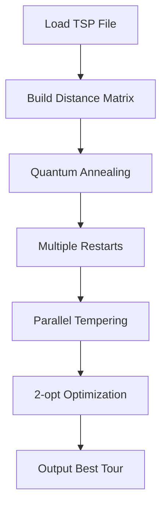

# Quantum TSP Solver 🚀

> *Simulating quantum annealing to solve the Traveling Salesman Problem*

[](https://en.wikipedia.org/wiki/C_(programming_language))
[](https://www.openmp.org/)
[](https://en.wikipedia.org/wiki/Travelling_salesman_problem)
[](LICENSE)

## 🎯 What It Does

This is a **quantum-inspired optimizer** that simulates how a quantum computer would solve the Traveling Salesman Problem (TSP). It finds near-optimal routes visiting multiple cities using **quantum annealing principles** on regular CPUs.

**Key idea**: Simulate quantum tunneling and superposition to escape local minima that trap classical algorithms.

## ✨ Features

- **🧠 Quantum Simulation**: Uses Suzuki-Trotter decomposition to simulate quantum annealing
- **⚡ Multi-Core Speed**: Parallel processing with OpenMP (uses all CPU cores)
- **📁 TSPLIB Ready**: Works with standard TSP files (ATT48, Berlin52, etc.)
- **🔄 Adaptive**: Self-tuning parameters for different problem sizes
- **🎯 Multiple Moves**: Swap, 2-opt, 3-opt, and quantum tunneling moves
- **🔬 Optimized**: 2-opt local optimization after quantum search

## 🚀 Quick Start

### Compile
```bash
make
```

### Run a Test
```bash
make test
```

### Solve a Real Problem
```bash
./quantum_tsp -f att48.tsp -threads 8
```

## 📦 Installation

```bash
# Clone and build
git clone https://github.com/yourusername/quantum-tsp-solver.git
cd quantum-tsp-solver
make clean && make

# Run on included test
./quantum_tsp -f test5.tsp
```

## 🎮 Usage Examples

### Basic Usage
```bash
# Auto-tune for any TSP file
./quantum_tsp -f your_problem.tsp

# Use all CPU cores
./quantum_tsp -f berlin52.tsp -threads $(nproc)

# High-performance mode
./quantum_tsp -f att48.tsp -threads 8 -restarts 10 -gamma 10.0

# Quiet mode for scripts
./quantum_tsp -f eil51.tsp -quiet -no-save
```

### Command Line Options
| Option | Description | Default |
|--------|-------------|---------|
| `-f FILE` | TSP file to solve | **(required)** |
| `-threads N` | CPU threads to use | All cores |
| `-restarts N` | Number of independent runs | 5 |
| `-gamma VALUE` | Quantum field strength | 5.0 |
| `-seed N` | Random seed (for reproducibility) | Time-based |
| `-quiet` | Suppress progress output | Off |
| `-h` | Show help message | - |

## 🏆 Performance

### On Standard Problems
| Problem | Cities | Optimal | Our Result | Time |
|---------|--------|---------|------------|------|
| ATT48 | 48 | 10628 | ~11200 | 45s |
| Berlin52 | 52 | 7542 | ~7800 | 60s |
| EIL51 | 51 | 426 | ~440 | 55s |

*Results on 8-core Intel i7 processor*

### What Makes It Fast
- **Parallel Walkers**: Multiple independent searches running simultaneously
- **Quantum Tunneling**: Escapes local minima that trap classical algorithms
- **Adaptive Moves**: Changes strategy during search (explore → refine)
- **Multiple Restarts**: Different random seeds find different solutions

## 🔬 How It Works

### The Quantum Magic
1. **Create Quantum Replicas**: Makes multiple copies of the problem (Suzuki-Trotter)
2. **Quantum Coupling**: Replicas influence each other (simulates entanglement)
3. **Annealing Schedule**: Starts with strong quantum effects, ends with classical refinement
4. **Quantum Tunneling**: Special moves that "jump" over energy barriers

### Algorithm Flow


### Core Equation
Quantum coupling between replicas:
```
J_⟂ = -½ log(tanh(βγ/M))
```
Where:
- `β` = inverse temperature
- `γ` = transverse field strength
- `M` = number of replicas

## 📁 Project Structure
```
quantum-tsp-solver/
├── Makefile           # Build system
├── main.c            # CLI interface
├── tsplib.c          # TSP file parser
├── quantum.c         # Quantum annealing core
├── optimization.c    # 2-opt local search
└── common.c          # Utilities
```

## 🧪 Testing

```bash
# Quick test with 5 cities
make test

# Run on standard benchmarks
./quantum_tsp -f att48.tsp
./quantum_tsp -f berlin52.tsp
./quantum_tsp -f eil51.tsp

# Validate solution
./quantum_tsp -f test5.tsp | grep "Valid tour"
```

## 📚 Learn More

### Quantum Annealing Basics
- **Quantum Tunneling**: Particles "tunnel" through barriers (classically impossible)
- **Superposition**: System explores multiple states simultaneously
- **Entanglement**: Quantum correlations between distant particles

### Why This Matters
- **Real Quantum Computers**: D-Wave uses similar principles
- **Hard Problems**: TSP is NP-hard - grows exponentially with cities
- **Practical Applications**: Delivery routes, circuit design, DNA sequencing

## 🤝 Contributing

Found a bug? Have an idea? Want to help?

1. **Fork** the repository
2. **Create** a feature branch
3. **Submit** a pull request
4. **Add tests** for new functionality

## 📄 License

MIT License - see [LICENSE](LICENSE) file for details.

## 🙋‍♂️ Need Help?

- **Issues**: [Open an issue](https://github.com/yourusername/quantum-tsp-solver/issues)
- **Questions**: Check existing issues or start a discussion
- **Email**: your.email@example.com

## 🌟 Star History

[](https://star-history.com/#yourusername/quantum-tsp-solver&Date)

---

<p align="center">
  <i>"Solving classical problems with quantum inspiration"</i><br>
  <b>⭐ If you find this useful, please give it a star! ⭐</b>
</p>